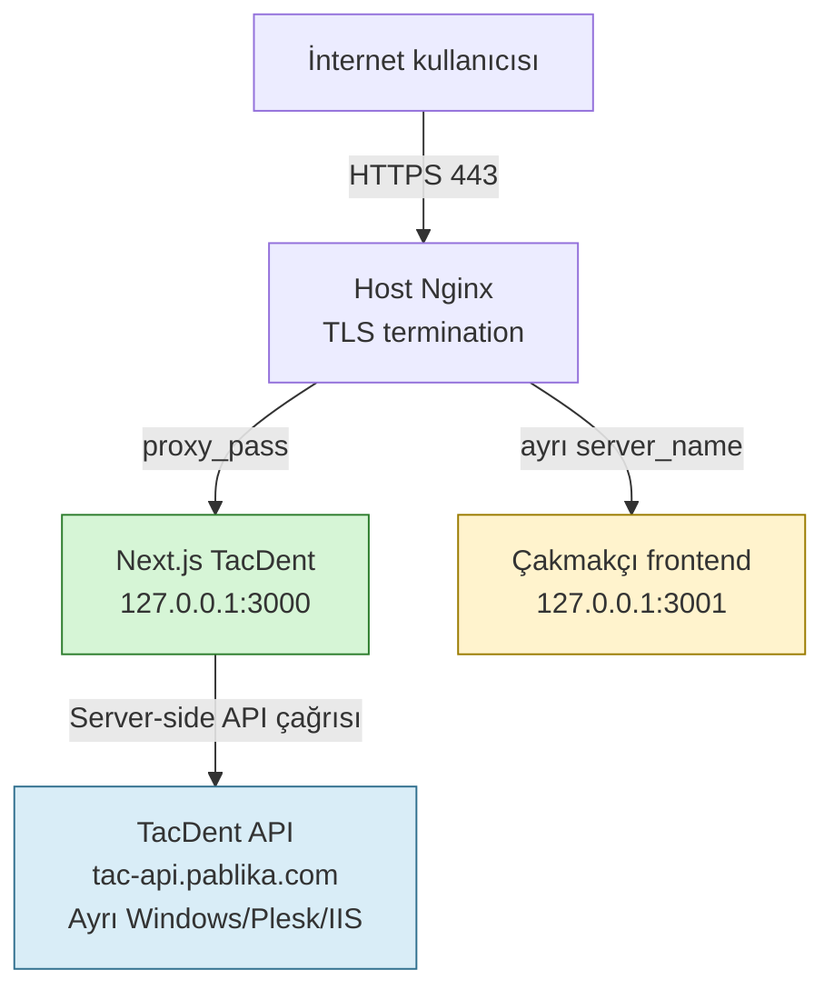
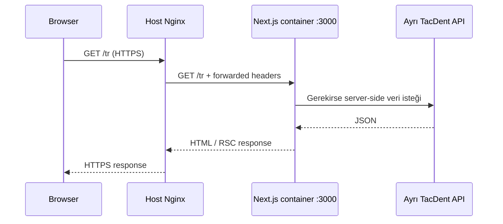
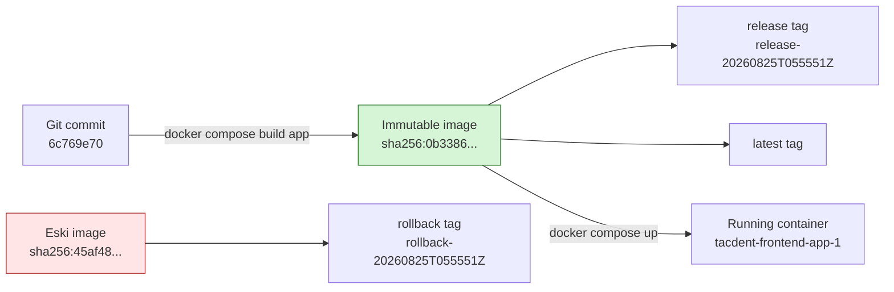
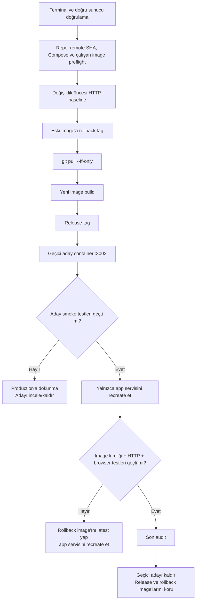
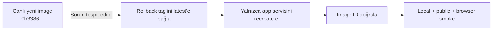

# TacDent Frontend VPS Release Runbook

> Release tarihi: 25 Ağustos 2026  
> Sunucu: `srv1830980` — `141.136.42.213`  
> Proje dizini: `/opt/tacdent/tacdent-frontend`  
> Canlı alan adı: `https://tugceaydincignakli.com`  
> Release ID: `20260825T055551Z`  
> Yayınlanan commit: `6c769e70b8c19df5203d23b5ef6cc2590f4bc279`

## Bu belgenin amacı

Bu dosya yalnızca “hangi komutu yazdık?” sorusunu değil, komutun arkasındaki zihinsel modeli öğretir. Hedef, bir sonraki sürümde komutları körlemesine kopyalamak yerine şu soruların cevabını önceden verebilmektir:

- Hangi katmanı değiştiriyorum?
- Çalışan sistemi değiştirmeden önce neyi kanıtlamalıyım?
- Docker image ile container arasındaki fark nedir?
- Build ile aktivasyonu neden ayırıyoruz?
- Nginx, Next.js container ve ayrı backend arasındaki trafik nasıl akıyor?
- Hata olursa elimde gerçekten çalışan bir rollback artefaktı var mı?
- Bir komutun başarılı görünmesi ile kullanıcının senaryosunun çalışması aynı şey mi?

Bu release sırasında yazdıklarımızın çoğu ayrı `.sh` dosyaları değil, terminale yapıştırılan kontrollü **shell komut bloklarıydı**. Shell açısından bunlar da küçük scriptlerdir: değişken tanımlar, koşullar, döngüler ve doğrulama kapıları içerirler.

## Çok önemli kullanım uyarısı

Bu belgedeki SHA, image ID, release ID, container oluşturulma zamanı ve rollback etiketi **25 Ağustos 2026 release'inin tarihsel değerleridir**. Yeni sürümde aynen kullanılmamalıdır.

Her yeni release'te yeniden üretilmesi gerekenler:

- Hedef remote commit SHA'sı,
- Çalışan container'ın gerçek image ID'si,
- UTC release ID,
- Release ve rollback tag adları,
- Aday container adı,
- Smoke test sonuçları.

Secret güvenliği:

- `.env` içeriğini ekrana yazdırma.
- `INTERNAL_API_KEY`, token, parola veya private key'i komuta gömme.
- Parolayı yalnızca SSH terminalinin parola istemine gir.
- `docker compose config` çıktısının tamamını paylaşma; bazı projelerde çözülmüş environment değerlerini gösterebilir. Bu release'te yalnızca `--quiet` kullanıldı.

## Durum etiketleri

| Etiket | Anlamı |
|---|---|
| **Salt okunur** | Sunucunun veya uygulamanın durumunu değiştirmez. |
| **Değişiklik yaptı** | Git checkout, Docker tag veya container durumunu değiştirdi. |
| **Geçici değişiklik** | Test için oluşturuldu ve release sonunda kaldırıldı. |
| **Tarayıcı doğrulaması** | HTTP 200'ün ötesinde kullanıcı etkileşimini test etti. |

---

## 1. Sonuç: ne yayınlandı?

| Alan | Release öncesi | Release sonrası |
|---|---|---|
| Git commit | `2827b80fa5a01f3422e61a534025a0b109e908ce` | `6c769e70b8c19df5203d23b5ef6cc2590f4bc279` |
| Çalışan image | `45af483175b6c06cdb4a7d84f75d24ba3dbab91996b1189a791ee65cfd6ed928` | `0b3386fe15891d36ebffa4853502ef77c0395099b179a34d312f83cb1f0c4f8b` |
| Production container | `tacdent-frontend-app-1` | Aynı servis adıyla yeni container |
| Production portu | `127.0.0.1:3000` | Değişmedi |
| Çakmakçı frontend | `127.0.0.1:3001` | Dokunulmadı, release sonrası `200` |
| TacDent backend | Ayrı Windows/Plesk/IIS sunucusu | Deploy edilmedi |
| Nginx | Host seviyesinde mevcut proxy | Değiştirilmedi |
| DNS/TLS | Mevcut canlı yapı | Değiştirilmedi |

Kalıcı image etiketleri:

```text
tacdent-frontend-app:release-20260825T055551Z
  -> sha256:0b3386fe15891d36ebffa4853502ef77c0395099b179a34d312f83cb1f0c4f8b

tacdent-frontend-app:rollback-20260825T055551Z
  -> sha256:45af483175b6c06cdb4a7d84f75d24ba3dbab91996b1189a791ee65cfd6ed928
```

## 2. Mimari: istek nereye gidiyor?



ASCII karşılığı:

```text
Kullanıcı
   |
   | HTTPS :443
   v
Host Nginx
   |-- tugceaydincignakli.com ---> 127.0.0.1:3000 ---> TacDent Next.js
   |
   `-- avcemcakmakci.com --------> 127.0.0.1:3001 ---> Çakmakçı Next.js

TacDent Next.js ---> HTTPS ---> tac-api.pablika.com ---> ASP.NET Core / IIS
```

Temel güvenlik özelliği: `3000` ve `3001` yalnızca `127.0.0.1` üzerinde dinler. İnternet bu portlara doğrudan erişmez; public trafik Nginx üzerinden gelir.

## 3. Nginx'in rolü

Nginx bu release'te değiştirilmedi, fakat bütün akışın giriş kapısıdır:



Önemli Nginx zihinsel modeli:

- Nginx TLS'i sonlandırır; container'ın HTTPS bilmesine gerek yoktur.
- `proxy_set_header Host $host` uygulamaya gerçek domain bilgisini taşır.
- `X-Forwarded-For` istemci zincirini, `X-Forwarded-Proto` dışarıdaki protokolü taşır.
- Admin CRUD için yalnızca GET/POST değil, PUT/DELETE/PATCH de proxy'den geçmelidir.
- Bir Nginx değişikliği yapılırsa önce `nginx -t`, ancak başarılıysa `systemctl reload nginx` uygulanır.
- `reload`, çalışan bağlantıları mümkün olduğunca korur; `restart` daha kesintili ve risklidir.

Bu release'te Nginx komutu çalıştırılmadı; çünkü problem uygulama image'ındaydı ve proxy konfigürasyonu zaten sağlıklıydı.

---

## 4. Docker zihinsel modeli

### 4.1 Image, tag ve container aynı şey değildir



- **Image:** Değişmez uygulama artefaktıdır. Dosya sistemi katmanları, Node runtime ve build çıktısını içerir.
- **Tag:** Bir image ID'ye verilen okunabilir işarettir. Tag taşınabilir; image içeriği değişmez.
- **Container:** Bir image'ın çalışan instance'ıdır.
- `latest` sihirli olarak “en doğru sürüm” demek değildir; yalnızca bir tag adıdır.
- Yeni image build edildiğinde `latest` yeni image'a geçebilir, fakat mevcut container eski image ID üzerinde çalışmaya devam eder.
- Container ancak recreate edildiğinde yeni image ile çalışır.

Bu nedenle build ve aktivasyonu ayırdık. Build hatalıysa production container'a hiç dokunmadık.

### 4.2 Dockerfile bu projede ne yapıyor?

TacDent Dockerfile üç ana stage kullanır:

1. `deps`: `npm ci` ile lock file'a göre dependency kurar.
2. `builder`: `npm run build` ile Next.js production/standalone çıktısını üretir.
3. `runner`: Yalnızca gerekli standalone dosyaları alır ve non-root `nextjs` kullanıcısıyla çalışır.

`NEXT_PUBLIC_*` değerleri build zamanında client bundle'a gömülür. Bu değerler değişirse yalnızca container restart etmek yetmez; image yeniden build edilmelidir.

Runtime değerleri:

- `API_URL`
- `INTERNAL_API_KEY`

Compose tarafından container environment'ına verilir. Bunların gerçek değerleri bu belgede bulunmaz.

---

## 5. Güvenli release akışı



Bu sıranın ana fikri: **her mutasyonun öncesinde geri dönüş noktasını oluştur; mutasyondan hemen sonra sonucu ölç.**

---

## 6. Kronolojik komut günlüğü

### 6.1 Terminal görünürlüğü ve SSH

**Etiket:** Salt okunur bağlantı doğrulaması.

Yerel terminalde önce bağlantı görünürlüğü doğrulandı:

```bash
echo TERMINAL_OK
```

Ardından VPS'e bağlanıldı:

```bash
ssh root@141.136.42.213
```

Parola yalnızca terminal promptuna girildi. Doğrulanan uzak prompt:

```text
root@srv1830980:~#
```

**Neden:** Yanlış terminalde veya yanlış sunucuda production komutu çalıştırmak, doğru komutun yanlış hedefe uygulanmasıdır. İlk doğrulama her zaman kimlik ve konum olmalıdır.

### 6.2 Production preflight

**Etiket:** Salt okunur.

```bash
cd /opt/tacdent/tacdent-frontend || exit 1
hostname
pwd
git status --short --branch
git rev-parse HEAD
git ls-remote origin refs/heads/main
docker compose config --quiet
docker compose ps
tacdent_container_id="$(docker compose ps -q app)"
docker inspect "$tacdent_container_id" \
  --format 'container={{.Name}} image_id={{.Image}} created={{.Created}} status={{.State.Status}} health={{if .State.Health}}{{.State.Health.Status}}{{else}}none{{end}}'
docker compose images
```

**Her satır ne yaptı?**

| Komut | Amaç |
|---|---|
| `cd ... \|\| exit 1` | Dizin yoksa devam etmeyi engelledi. Yanlış dizinde Docker/Git komutu çalışmadı. |
| `hostname` | Doğru VPS'in `srv1830980` olduğunu kanıtladı. |
| `pwd` | Doğru repo dizininde olduğumuzu kanıtladı. |
| `git status` | Kirli çalışma ağacı veya yanlış branch riskini kontrol etti. |
| `git rev-parse HEAD` | Sunucudaki checkout'un kesin SHA'sını verdi. |
| `git ls-remote` | Lokal remote ref'i güncellemeden GitHub'daki gerçek `main` SHA'sını okudu. |
| `compose config --quiet` | `.env` ve Compose çözümlemesinin geçerli olduğunu, değerleri ekrana dökmeden kontrol etti. |
| `compose ps` | Çalışan servis/port durumunu gösterdi. |
| `docker inspect` | Container'ın tag değil gerçek immutable image ID'sini verdi. |

**Doğrulanan sonuç:**

- Repo temizdi.
- Sunucu checkout'u `2827b80...` idi.
- Remote `main` `6c769e70...` idi.
- Production container `45af483...` image'ıyla `127.0.0.1:3000` üzerinde çalışıyordu.

### 6.3 Değişiklik öncesi baseline

**Etiket:** Salt okunur.

```bash
df -h / /var/lib/docker

curl -sS -o /dev/null \
  -w 'tacdent_local_tr status=%{http_code} time=%{time_total}\n' \
  -H 'Host: tugceaydincignakli.com' \
  http://127.0.0.1:3000/tr

curl -sS -o /dev/null \
  -w 'tacdent_public_tr status=%{http_code} time=%{time_total}\n' \
  https://tugceaydincignakli.com/tr

curl -sS -o /dev/null \
  -w 'tacdent_public_en status=%{http_code} time=%{time_total}\n' \
  https://tugceaydincignakli.com/en

curl -sS -o /dev/null \
  -w 'cakmakci_local status=%{http_code} time=%{time_total}\n' \
  -H 'Host: avcemcakmakci.com' \
  http://127.0.0.1:3001/tr
```

**Neden:** Release sonrası görülen bir hatanın yeni mi, önceden var mı olduğunu ayırmak için önce baseline gerekir. Aynı VPS'teki Çakmakçı ayrıca “komşu servis canary” kontrolü olarak kullanıldı.

**Sonuç:** Diskte `88 GB` boş alan vardı; bütün baseline istekleri `200` döndü.

### 6.4 Eski image'ı rollback etiketiyle koruma

**Etiket:** Değişiklik yaptı; çalışan container'ı değiştirmedi.

```bash
TACDENT_RELEASE_ID="$(date -u +%Y%m%dT%H%M%SZ)"
TACDENT_CURRENT_IMAGE="$(docker inspect "$(docker compose ps -q app)" --format '{{.Image}}')"
TACDENT_ROLLBACK_TAG="tacdent-frontend-app:rollback-${TACDENT_RELEASE_ID}"

docker image tag "$TACDENT_CURRENT_IMAGE" "$TACDENT_ROLLBACK_TAG"

printf 'release_id=%s\nrollback_tag=%s\nimage_id=%s\n' \
  "$TACDENT_RELEASE_ID" \
  "$TACDENT_ROLLBACK_TAG" \
  "$TACDENT_CURRENT_IMAGE"

docker image inspect "$TACDENT_ROLLBACK_TAG" \
  --format 'verified_id={{.Id}} created={{.Created}} tags={{json .RepoTags}}'
```

**Neden:** Bir sonraki build `latest` tag'ini yeni image'a taşıyacaktı. Eski çalışan image yalnızca “dangling” bir ID olarak kalırsa operatörün rollback sırasında yanlış image seçme riski artar. Zaman damgalı tag, çalışan iyi artefaktı isimlendirdi.

**Etkisi:** Sadece Docker metadata'sına yeni tag eklendi. Container restart olmadı.

**Doğrulama:** Rollback tag ve çalışan container aynı `45af483...` image ID'sine çözüldü.

### 6.5 Git checkout'u hedef commit'e ilerletme

**Etiket:** Değişiklik yaptı; çalışan container'ı etkilemedi.

```bash
git pull --ff-only origin main

git rev-parse HEAD
git status --short --branch
docker compose config --quiet

test "$(git rev-parse HEAD)" = "6c769e70b8c19df5203d23b5ef6cc2590f4bc279" \
  && echo TARGET_COMMIT_OK \
  || echo TARGET_COMMIT_MISMATCH
```

**Neden `--ff-only`?** Normal `git pull`, uygun durumda merge commit üretebilir. Production checkout'unda sürpriz merge istemiyoruz. `--ff-only`, local tarih remote'un doğrusal atası değilse işlemi durdurur.

**Etkisi:** Yalnızca repo dosyaları `2827b80` commitinden `6c769e70` commitine ilerledi. Çalışan container immutable eski image üzerinde kalmaya devam etti.

### 6.6 Yeni production image'ını build etme

**Etiket:** Değişiklik yaptı; çalışan container'ı etkilemedi.

```bash
docker compose build app

TACDENT_NEW_IMAGE="$(docker image inspect tacdent-frontend-app:latest --format '{{.Id}}')"
TACDENT_RUNNING_IMAGE="$(docker inspect "$(docker compose ps -q app)" --format '{{.Image}}')"
TACDENT_RELEASE_TAG="tacdent-frontend-app:release-${TACDENT_RELEASE_ID}"

docker image tag "$TACDENT_NEW_IMAGE" "$TACDENT_RELEASE_TAG"

printf 'running_image=%s\nnew_image=%s\nrelease_tag=%s\n' \
  "$TACDENT_RUNNING_IMAGE" \
  "$TACDENT_NEW_IMAGE" \
  "$TACDENT_RELEASE_TAG"

docker image inspect "$TACDENT_RELEASE_TAG" \
  --format 'verified_id={{.Id}} created={{.Created}} size={{.Size}}'

test "$TACDENT_NEW_IMAGE" != "$TACDENT_RUNNING_IMAGE" \
  && echo BUILD_ARTIFACT_READY \
  || echo BUILD_ARTIFACT_SAME_AS_RUNNING
```

**Build sırasında olanlar:**

- `node:20-alpine` base image çözüldü.
- `npm ci` yaklaşık 44 saniyede tamamlandı.
- Next.js `npm run build` yaklaşık 39 saniyede tamamlandı.
- Standalone runner image oluşturuldu.
- Toplam build yaklaşık 123 saniye sürdü.

**Neden aktivasyondan ayrı?** Build başarısız olursa kullanıcı trafiği hâlâ eski container'a gider. `docker compose up -d --build` tek komutta kullanılsaydı build ve servis değişimi aynı operasyonun içinde gizlenirdi.

**Sonuç:** Yeni image `0b3386fe...`, çalışan image hâlâ `45af483...` idi.

### 6.7 Yeni image'ı geçici aday container'da test etme

**Etiket:** Geçici değişiklik; public trafiği etkilemedi.

```bash
TACDENT_CANDIDATE="tacdent-frontend-candidate-${TACDENT_RELEASE_ID}"

if ss -H -ltn 'sport = :3002' | grep -q .; then
  echo PORT_3002_BUSY
else
  docker compose run -d \
    --no-deps \
    --name "$TACDENT_CANDIDATE" \
    -p 127.0.0.1:3002:3000 \
    app

  for attempt in $(seq 1 30); do
    candidate_status="$(curl -sS -o /dev/null -w '%{http_code}' \
      -H 'Host: tugceaydincignakli.com' \
      http://127.0.0.1:3002/tr || true)"

    if [ "$candidate_status" = "200" ]; then
      echo CANDIDATE_READY
      break
    fi

    sleep 2
  done

  docker inspect "$TACDENT_CANDIDATE" \
    --format 'container={{.Name}} image={{.Image}} status={{.State.Status}}'

  curl -sS -o /dev/null \
    -w 'candidate_tr status=%{http_code} time=%{time_total}\n' \
    -H 'Host: tugceaydincignakli.com' \
    http://127.0.0.1:3002/tr

  curl -sS -o /dev/null \
    -w 'candidate_en status=%{http_code} time=%{time_total}\n' \
    -H 'Host: tugceaydincignakli.com' \
    http://127.0.0.1:3002/en

  curl -sS -o /dev/null \
    -w 'candidate_appointments status=%{http_code} time=%{time_total}\n' \
    -H 'Host: tugceaydincignakli.com' \
    http://127.0.0.1:3002/tr/appointments

  curl -sS -o /dev/null \
    -w 'candidate_unknown status=%{http_code} time=%{time_total}\n' \
    -H 'Host: tugceaydincignakli.com' \
    http://127.0.0.1:3002/tr/release-smoke-missing
fi
```

**Shell öğretisi:**

- `if ...; then ... else ... fi` port çakışması halinde güvenli duruş sağladı.
- `for` döngüsü uygulamanın hazır olması için sınırlı süre bekledi.
- `|| true`, ilk bağlantı henüz uygulama başlamadığı için başarısız olduğunda bütün bloğun kesilmesini engelledi.
- Aday port da yalnızca loopback'e bağlandı; internete açılmadı.

**Gözlenen geçici olay:** İlk readiness isteğinde `Recv failure: Connection reset by peer` görüldü. Bu, container prosesi portu açarken olan kısa başlangıç penceresiydi. Döngü sonraki denemede `200` aldı. Tek başına ilk reset, image'ın bozuk olduğu anlamına gelmedi.

**Sonuç:** `/tr`, `/en`, randevu `200`; bilinmeyen rota beklenen `404`; aday doğru `0b3386fe...` image'ıyla çalıştı.

### 6.8 Production aktivasyonu

**Etiket:** Değişiklik yaptı; kullanıcı trafiğine çıkan sürümü değiştirdi.

```bash
docker compose up -d \
  --no-deps \
  --no-build \
  --force-recreate \
  --wait \
  --wait-timeout 60 \
  app

TACDENT_ACTIVE_CONTAINER="$(docker compose ps -q app)"
TACDENT_ACTIVE_IMAGE="$(docker inspect "$TACDENT_ACTIVE_CONTAINER" --format '{{.Image}}')"

docker inspect "$TACDENT_ACTIVE_CONTAINER" \
  --format 'container={{.Name}} image={{.Image}} created={{.Created}} status={{.State.Status}}'

test "$TACDENT_ACTIVE_IMAGE" = "$TACDENT_NEW_IMAGE" \
  && echo ACTIVE_IMAGE_OK \
  || echo ACTIVE_IMAGE_MISMATCH

for attempt in $(seq 1 30); do
  active_status="$(curl -sS -o /dev/null -w '%{http_code}' \
    -H 'Host: tugceaydincignakli.com' \
    http://127.0.0.1:3000/tr || true)"

  if [ "$active_status" = "200" ]; then
    echo ACTIVE_SERVICE_READY
    break
  fi

  sleep 2
done
```

Bayrakların anlamı:

| Bayrak | Neden kullanıldı? |
|---|---|
| `--no-deps` | Aynı Compose projesindeki başka bağımlı servisleri değiştirmemek için. |
| `--no-build` | Az önce doğruladığımız image'ı kullanmak, aktivasyon anında sürpriz rebuild yapmamak için. |
| `--force-recreate` | Servis tanımı aynı görünse bile yeni container oluşturmak için. |
| `--wait` | Compose'un servis running durumunu beklemesi için. |
| `--wait-timeout 60` | Sonsuz bekleme yerine kontrollü üst sınır için. |

**Önemli nüans:** Son `docker inspect` çıktısında uygulamaya tanımlı Docker `HEALTHCHECK` olmadığı için `health=none` görüldü. Compose arayüzünün kısa süreli “Healthy” ifadesi tek başına uygulama sağlığının kanıtı kabul edilmedi. Gerçek kanıt, doğru image ID ve uygulama seviyesindeki HTTP testleriydi.

### 6.9 Aktivasyon sonrası hızlı smoke test

**Etiket:** Salt okunur.

```bash
docker compose ps

curl -sS -o /dev/null \
  -w 'live_local_tr status=%{http_code} time=%{time_total}\n' \
  -H 'Host: tugceaydincignakli.com' \
  http://127.0.0.1:3000/tr

curl -sS -o /dev/null \
  -w 'live_public_tr status=%{http_code} time=%{time_total}\n' \
  https://tugceaydincignakli.com/tr

curl -sS -o /dev/null \
  -w 'live_public_en status=%{http_code} time=%{time_total}\n' \
  https://tugceaydincignakli.com/en

curl -sS -o /dev/null \
  -w 'cakmakci_after_activation status=%{http_code} time=%{time_total}\n' \
  -H 'Host: avcemcakmakci.com' \
  http://127.0.0.1:3001/tr
```

**Sonuç:** Yeni image aktifti; TacDent yerel/public TR-EN ve Çakmakçı `200` döndü.

### 6.10 Gerçek tarayıcıda dil geçişi

**Etiket:** Tarayıcı doğrulaması.

HTTP `200` yalnızca bir sayfanın cevap verdiğini söyler. Bu bug ise kullanıcının dil bağlantısına tıklamasıyla ilgiliydi. Bu yüzden canlı sayfa gerçek tarayıcıda açıldı:

1. `/tr` sayfasında **EN** bağlantısına tıklandı.
2. URL'nin `/en` olduğu doğrulandı.
3. İngilizce title ve `h1` doğrulandı.
4. Konsol error kayıtlarının boş olduğu doğrulandı.
5. **TR** bağlantısına tıklandı.
6. URL'nin `/tr` olduğu, Türkçe title ve `h1` geldiği doğrulandı.
7. Ters yönde de konsol error kaydı oluşmadı.

Doğrulanan başlıklar:

```text
TR: Dalaman Diş Hekimi — Güvenilir ve Modern Diş Bakımı
EN: Dalaman Dentist — Trusted, Modern Dental Care
```

Bu adım, “container çalışıyor” kontrolü ile “asıl kullanıcı hatası düzeldi” kontrolünün farklı olduğunu gösterir.

### 6.11 Son audit

**Etiket:** Salt okunur.

```bash
git rev-parse HEAD

docker inspect "$(docker compose ps -q app)" \
  --format 'active_container={{.Name}} active_image={{.Image}} status={{.State.Status}} health={{if .State.Health}}{{.State.Health.Status}}{{else}}none{{end}}'

docker compose logs --since 10m --tail 300 app \
  | grep -Ei 'error|exception|fatal|unhandled|failed' \
  || echo NO_ERROR_PATTERNS_IN_RECENT_LOGS

for release_url in \
  https://tugceaydincignakli.com/tr/services \
  https://tugceaydincignakli.com/en/services \
  https://tugceaydincignakli.com/tr/appointments \
  https://tugceaydincignakli.com/tr/admin/login \
  https://tugceaydincignakli.com/sitemap.xml \
  https://tugceaydincignakli.com/robots.txt \
  https://tugceaydincignakli.com/tr/release-smoke-missing
do
  curl -sS -o /dev/null \
    -w '%{http_code} %{time_total} %{url_effective}\n' \
    "$release_url"
done

curl -sS -o /dev/null \
  -w 'cakmakci_final status=%{http_code} time=%{time_total}\n' \
  -H 'Host: avcemcakmakci.com' \
  http://127.0.0.1:3001/tr

docker ps --filter "name=tacdent-frontend" \
  --format 'container={{.Names}} status={{.Status}} image={{.Image}}'
```

**Sonuç:**

- Commit ve aktif image doğruydu.
- Son loglarda seçilen hata desenleri bulunmadı.
- Altı gerçek rota `200` döndü.
- Bilinmeyen rota `404` döndü.
- Çakmakçı `200` döndü.

Log grep'i faydalı bir sinyaldir ama tam log analizi değildir. Uygulama farklı bir kelimeyle hata yazabilir veya sessizce yanlış davranabilir; bu yüzden HTTP ve tarayıcı kontrolleriyle birlikte kullanıldı.

### 6.12 Geçici aday container'ı temizleme

**Etiket:** Geçici test container'ını sildi; production ve image'lar korundu.

```bash
docker inspect "$TACDENT_CANDIDATE" \
  --format 'removing_candidate={{.Name}} image={{.Image}} status={{.State.Status}}'

docker rm -f "$TACDENT_CANDIDATE"

test -z "$(docker ps -aq --filter "name=^/${TACDENT_CANDIDATE}$")" \
  && echo CANDIDATE_REMOVED \
  || echo CANDIDATE_STILL_EXISTS

ss -H -ltn 'sport = :3002' \
  || true

docker image inspect "$TACDENT_RELEASE_TAG" \
  --format 'release_image={{.Id}} tags={{json .RepoTags}}'

docker image inspect "$TACDENT_ROLLBACK_TAG" \
  --format 'rollback_image={{.Id}} tags={{json .RepoTags}}'

docker compose ps
```

**Neden önce inspect?** Silme hedefini çözümleyip production container olmadığını son kez kanıtladık.

**Sonuç:** Yalnızca `tacdent-frontend-candidate-20260825T055551Z` kaldırıldı, `3002` boşaldı, production container ile release/rollback image'ları korundu.

---

## 7. Bu release'te neye dokunmadık?

- TacDent backend deploy edilmedi.
- Backend IIS/Plesk/WebDAV süreci çalıştırılmadı.
- Backend database veya migration çalıştırılmadı.
- Çakmakçı container'ları recreate edilmedi.
- Nginx config değiştirilmedi veya reload edilmedi.
- DNS ve TLS sertifikaları değiştirilmedi.
- `.env` dosyaları değiştirilmedi veya içerikleri görüntülenmedi.
- Ubuntu paket güncellemesi/reboot yapılmadı.
- Docker image prune yapılmadı.
- Rollback image silinmedi.

Scope kontrolü production güvenliğinin parçasıdır. “Sürüm çıkarıyorum” demek sunucudaki her şeyi güncellemek demek değildir.

## 8. Rollback nasıl çalışır?



25 Ağustos release'i için hazır rollback:

```bash
cd /opt/tacdent/tacdent-frontend

docker image tag \
  tacdent-frontend-app:rollback-20260825T055551Z \
  tacdent-frontend-app:latest

docker compose up -d \
  --no-deps \
  --no-build \
  --force-recreate \
  --wait \
  --wait-timeout 60 \
  app
```

Ardından doğrulama:

```bash
docker inspect "$(docker compose ps -q app)" \
  --format 'container={{.Name}} image={{.Image}} status={{.State.Status}}'

curl -sS -o /dev/null \
  -w 'rollback_local status=%{http_code} time=%{time_total}\n' \
  -H 'Host: tugceaydincignakli.com' \
  http://127.0.0.1:3000/tr

curl -sS -o /dev/null \
  -w 'rollback_public status=%{http_code} time=%{time_total}\n' \
  https://tugceaydincignakli.com/tr
```

Image rollback, çalışan binary/Next.js artefaktını geri alır. Git checkout yeni committe kalır. Sonradan tekrar build yapılacaksa Git'in de hangi committe olması gerektiği ayrıca kararlaştırılmalıdır.

---

## 9. Bir sonraki release için yeniden kullanılabilir şablon

Bu bölüm tarihsel sabitleri mümkün olduğunca runtime'da üretir. Yine de her komutu çalıştırmadan önce hedefi okuyup doğrula.

### Aşama A — salt okunur preflight

```bash
cd /opt/tacdent/tacdent-frontend || exit 1

hostname
pwd
git status --short --branch
git rev-parse HEAD
git ls-remote origin refs/heads/main
docker compose config --quiet
docker compose ps

TACDENT_RUNNING_CONTAINER="$(docker compose ps -q app)"
TACDENT_RUNNING_IMAGE="$(docker inspect "$TACDENT_RUNNING_CONTAINER" --format '{{.Image}}')"

printf 'running_container=%s\nrunning_image=%s\n' \
  "$TACDENT_RUNNING_CONTAINER" \
  "$TACDENT_RUNNING_IMAGE"
```

Durma koşulları:

- Yanlış hostname veya dizin,
- Kirli çalışma ağacı,
- Beklenmeyen branch,
- Remote hedef SHA bilinmiyor,
- Compose geçersiz,
- Production container çalışmıyor,
- Disk alanı yetersiz,
- Çakmakçı baseline zaten başarısız.

### Aşama B — rollback noktası

```bash
TACDENT_RELEASE_ID="$(date -u +%Y%m%dT%H%M%SZ)"
TACDENT_ROLLBACK_TAG="tacdent-frontend-app:rollback-${TACDENT_RELEASE_ID}"

docker image tag "$TACDENT_RUNNING_IMAGE" "$TACDENT_ROLLBACK_TAG"
docker image inspect "$TACDENT_ROLLBACK_TAG" --format '{{.Id}} {{json .RepoTags}}'
```

### Aşama C — checkout ve build

```bash
git pull --ff-only origin main
docker compose config --quiet
docker compose build app

TACDENT_NEW_IMAGE="$(docker image inspect tacdent-frontend-app:latest --format '{{.Id}}')"
TACDENT_RELEASE_TAG="tacdent-frontend-app:release-${TACDENT_RELEASE_ID}"
docker image tag "$TACDENT_NEW_IMAGE" "$TACDENT_RELEASE_TAG"
```

### Aşama D — aday test

Aday portun boş olduğunu kontrol et, yeni image'ı loopback test portunda çalıştır, kritik rotaları test et. Production'a geçmeden adayın gerçek image ID'sini doğrula.

### Aşama E — hedef servisi aktive et

```bash
docker compose up -d \
  --no-deps \
  --no-build \
  --force-recreate \
  --wait \
  --wait-timeout 60 \
  app
```

### Aşama F — doğrula ve kaydet

- Aktif image ID release image ID ile aynı mı?
- Local `3000` cevap veriyor mu?
- Public TR/EN ve kritik rotalar cevap veriyor mu?
- Bilinmeyen rota doğru `404` mü?
- Gerçek hata senaryosu tarayıcıda çalışıyor mu?
- Son loglarda hata var mı?
- Çakmakçı `3001` hâlâ sağlıklı mı?
- Aday container kaldırıldı mı?
- Rollback tag hâlâ var mı?

---

## 10. Shell script yazarken öğrenilecek kalıplar

### 10.1 Güvenli başlangıç

Kaydedilmiş `.sh` scriptlerinde yaygın başlangıç:

```bash
#!/usr/bin/env bash
set -Eeuo pipefail
```

- `-e`: Hatalı komutta durur.
- `-u`: Tanımsız değişken kullanımında durur.
- `-o pipefail`: Pipeline'ın ara komutu hata verirse bunu gizlemez.
- `-E`: `ERR` trap'inin fonksiyon/subshell içinde de çalışmasına yardım eder.

Ancak `set -e` sihir değildir. Beklenen bir başarısızlığı bilinçli ele almak gerekir:

```bash
if curl -fsS http://127.0.0.1:3000/tr >/dev/null; then
  echo "ready"
else
  echo "not ready"
fi
```

### 10.2 Değişkenleri her zaman quote et

```bash
docker inspect "$TACDENT_RUNNING_CONTAINER"
```

Quote edilmemiş değişken boşluk/glob nedeniyle farklı argümanlara bölünebilir.

### 10.3 Önce hedefi çözümle, sonra değiştir

```bash
candidate_id="$(docker ps -aq --filter "name=^/${TACDENT_CANDIDATE}$")"
printf 'target=%s\n' "$candidate_id"
```

Silme/recreate öncesi exact hedefi inspect etmek production kazalarını azaltır.

### 10.4 Sınırlı retry döngüsü

```bash
for attempt in $(seq 1 30); do
  if curl -fsS http://127.0.0.1:3000/tr >/dev/null; then
    echo READY
    break
  fi
  sleep 2
done
```

Sonsuz `while true` yerine süre sınırı vardır. Bu örnek en fazla yaklaşık 60 saniye bekler.

### 10.5 Temizlik için trap

Geçici kaynak üreten bağımsız scriptlerde:

```bash
cleanup() {
  docker rm -f "$TACDENT_CANDIDATE" >/dev/null 2>&1 || true
}

trap cleanup EXIT
```

Production incelemesinde otomatik cleanup bazen debug kanıtını erken silebilir. Bu release'te aday container, sonuçları okuduktan sonra ayrı ve açık bir adımla kaldırıldı.

---

## 11. Nginx öğrenme notları

Salt okunur inceleme komutları:

```bash
nginx -T
systemctl status nginx --no-pager
ss -ltnp
```

`nginx -T` bütün etkin konfigürasyonu yazdırabilir; çıktı uzun olabilir ve ortama özel bilgi içerebilir. Paylaşmadan önce gözden geçir.

Güvenli değişiklik paterni:

```bash
nginx -t
systemctl reload nginx
```

İlk komut başarısızsa ikinciyi çalıştırma:

```bash
if nginx -t; then
  systemctl reload nginx
else
  echo "Nginx config invalid; reload edilmedi" >&2
  exit 1
fi
```

Nginx için temel debug ayrımı:

| Belirti | İlk bakılacak yer |
|---|---|
| `502 Bad Gateway` | Upstream container çalışıyor mu, doğru port mu? |
| `404` | Nginx mi döndürüyor, Next.js mi? Response body/header karşılaştır. |
| `405` | Method Nginx tarafından engelleniyor mu? |
| Redirect loop | `X-Forwarded-Proto`, canonical host ve uygulama redirectleri. |
| SSL hatası | Certificate path, expiry, server_name ve `nginx -t`. |

---

## 12. Hata senaryoları ve kararlar

| Durum | Anlamı | Yapılacak |
|---|---|---|
| Repo kirli | Sunucuda izlenmeyen/değişmiş dosya var | Pull/build yapma; değişikliğin sahibini ve nedenini bul. |
| `git pull --ff-only` durdu | Local ve remote tarih ayrışmış | Merge/reset yapma; SHA'ları incele ve karar al. |
| `npm ci` başarısız | Lock file, registry veya Node/npm uyumsuzluğu | Production'a dokunma; Dockerfile ve lock uyumunu düzelt. |
| Build başarısız | Yeni artefakt yok | Eski container çalışmaya devam eder; aktivasyon yapma. |
| Aday ilk curl reset | Uygulama henüz hazır olmayabilir | Sınırlı retry sonucuna bak; sürekli ise logları incele. |
| Aday kritik rota başarısız | Yeni image production'a uygun değil | Aktivasyon yapma; adayı incele ve kaldır. |
| Active image mismatch | Container beklenen image'la açılmadı | Public doğrulamaya güvenme; compose/tag durumunu çöz. |
| Public başarısız, local başarılı | Nginx/DNS/TLS katmanı şüpheli | Nginx log/config ve dış endpointi incele. |
| Local başarısız | Container/app/runtime şüpheli | Container log, port ve environment çözümlemesini incele. |
| Çakmakçı başarısız | Ortak hostta yan etki olabilir | Release'i kapatma; kaynak kullanımını ve Nginx'i incele. |
| Browser geçişi başarısız, curl 200 | UI/runtime bug devam ediyor | HTTP sağlığını “tam başarı” sayma; rollback/escalation değerlendir. |
| SSH yeniden bağlandı | Shell değişkenleri kayboldu | Tag/image değerlerini Docker'dan yeniden çöz; eski değişkene güvenme. |

## 13. Bilinen teknik borç ve geliştirme önerileri

1. **Lint:** Önceki incelemede lint kırmızıydı. Production build ve TypeScript geçti; bu release'i engellemedi. Yine de lint borcu ayrı PR ile temizlenmeli.
2. **Docker healthcheck:** Compose servisinde açık bir uygulama healthcheck'i yok. Örneğin `/tr` veya daha hafif bir health endpoint için Dockerfile/Compose healthcheck tasarlanabilir.
3. **Image provenance:** Image içine `org.opencontainers.image.revision=$GIT_SHA` label'ı eklenirse commit-image eşlemesi doğrudan inspect edilebilir.
4. **Release scripti:** Bu akış, dry-run ve açık durma kapıları olan versiyon kontrollü bir `scripts/release-vps.sh` dosyasına dönüştürülebilir.
5. **Otomatik smoke:** Kritik rotalar ve beklenen status kodları küçük bir `scripts/smoke-production.sh` içinde tutulabilir.
6. **Log/metric alarmı:** HTTP smoke anlık kanıttır. 5xx oranı, restart count, latency ve uptime için sürekli gözlem gerekir.
7. **Rollback tatbikatı:** Tag'in varlığını doğruladık; planlı bir bakım penceresinde gerçek rollback/forward tatbikatı ayrıca yapılabilir.
8. **Eski image retention:** Disk bugün rahattı. İleride prune işlemi körlemesine değil, korunacak release/rollback politikasıyla yapılmalı.

## 14. Öğrenmek için güvenli mini laboratuvar

Production'da değişiklik yapmadan Docker'ı anlamak için salt okunur komutlar:

```bash
docker ps
docker compose ps
docker compose images
docker image ls
docker inspect "$(docker compose ps -q app)"
docker compose config --quiet
docker compose logs --tail 50 app
ss -ltnp
```

Sorulacak sorular:

- Container adı ile service adı aynı mı?
- Container hangi image ID ile çalışıyor?
- `latest` tag'i hangi image ID'yi gösteriyor?
- Port hostta `0.0.0.0` mı, `127.0.0.1` mı?
- Container restart count nedir?
- Repo HEAD ile image arasında doğrudan bir label var mı?
- Nginx hangi hostu hangi loopback porta yönlendiriyor?

İyi bir sonraki çalışma: Bu runbook'taki tekrar eden read-only kontrolleri küçük bir `preflight` shell scriptine dönüştürmek, scripti ShellCheck ile analiz etmek ve önce lokal/test ortamında çalıştırmak.

---

## 15. Son kontrol listesi

- [x] Terminal görünürlüğü doğrulandı.
- [x] Doğru VPS ve doğru dizin doğrulandı.
- [x] Repo temizliği ve remote hedef SHA doğrulandı.
- [x] Compose config secret yazdırmadan doğrulandı.
- [x] Eski çalışan image rollback tag'iyle korundu.
- [x] `git pull --ff-only` kullanıldı.
- [x] Build aktivasyondan ayrı tamamlandı.
- [x] Yeni image release tag'iyle korundu.
- [x] Yeni image geçici aday container'da test edildi.
- [x] Yalnızca TacDent `app` servisi recreate edildi.
- [x] Aktif image kimliği doğrulandı.
- [x] Local ve public smoke testleri geçti.
- [x] Gerçek TR ↔ EN tarayıcı geçişi doğrulandı.
- [x] Son log taraması temizdi.
- [x] Çakmakçı release öncesi/sonrası sağlıklıydı.
- [x] Geçici aday container kaldırıldı.
- [x] Release ve rollback image'ları korundu.
- [x] Backend, Nginx, DNS, TLS ve `.env` kapsam dışında bırakıldı.

## Kısa özet

Bu release'in en önemli dersi tek bir Docker komutu değil, güvenli değişiklik sırasıdır:

```text
Önce gerçeği ölç
→ çalışan iyiyi isimlendir ve koru
→ kodu fast-forward et
→ yeni artefaktı ayrı build et
→ production dışında test et
→ yalnızca hedef servisi değiştir
→ image + HTTP + gerçek kullanıcı senaryosunu doğrula
→ geçici kaynakları temizle
→ rollback artefaktını koru
```

“Container up” başarı değildir. Başarı; beklenen committen üretilmiş doğru image'ın çalışması, kritik kullanıcı senaryosunun gerçek tarayıcıda geçmesi, komşu servisin etkilenmemesi ve geri dönüş yolunun hazır olmasıdır.
